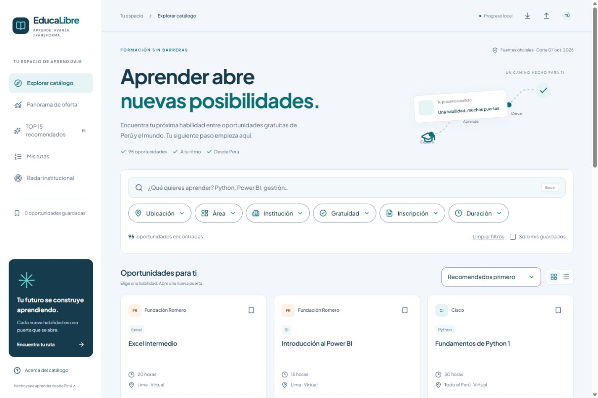
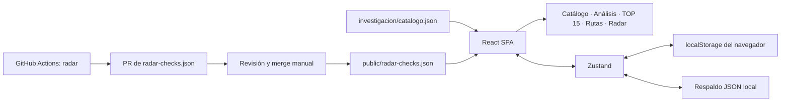

<div align="center">

# PALLAQUINO — EducaLibre

### Tu próximo paso empieza aquí.

Plataforma de formación gratuita para explorar oportunidades de Perú y el mundo, construir rutas de aprendizaje y seguir tu progreso.

[](https://react.dev/)
[](https://www.typescriptlang.org/)
[](https://vite.dev/)
[](https://tailwindcss.com/)

[](https://nodejs.org/)
[](https://www.radix-ui.com/primitives/docs/components/select)
[](https://zustand.docs.pmnd.rs/)
[](https://recharts.org/)
[](docs/DEPLOYMENT.md)
[](https://www.python.org/)

[](https://github.com/jylmdev-cyber/educate-free/actions/workflows/deploy.yml)

**95 oportunidades · 15 recomendaciones · 4 rutas iniciales · 20 instituciones**

[Inicio rápido](#inicio-rápido) · [Stack](#stack-tecnológico) · [Publicación](docs/DEPLOYMENT.md) · [Contribuir](CONTRIBUTING.md)

</div>

---



> Captura real de la aplicación local. Los badges de versiones describen el stack instalado; CI muestra el estado del workflow. El badge de Pages indica configuración disponible, no una publicación ya realizada.

**[Repositorio](https://github.com/jylmdev-cyber/educate-free) · [Validación en GitHub Actions](https://github.com/jylmdev-cyber/educate-free/actions/workflows/deploy.yml)**. El enlace de demo se añadirá cuando Pages se publique y se compruebe.

## Qué es EducaLibre

EducaLibre transforma el informe de oportunidades de capacitación técnica, digital y profesional en una **SPA en español**. Permite explorar la oferta, comparar condiciones de gratuidad y organizar un itinerario personal desde Perú.

Funciona como un sitio estático: la aplicación no necesita un servidor de cuentas ni una base de datos remota. Favoritos, rutas, progreso y revisiones se guardan en el navegador. El radar automatizado se ejecuta por separado mediante GitHub Actions.

### Funcionalidades

| Módulo | Qué permite hacer |
| --- | --- |
| **Explorar catálogo** | Buscar con tolerancia a errores, combinar seis filtros y mostrar tarjetas o lista. Incluye eliminación individual de filtros, ordenamiento y favoritos. |
| **Panorama de oferta** | Explorar gráficos, distribución por ubicación, áreas e instituciones, con tablas complementarias accesibles. |
| **TOP 15** | Consultar programas recomendados y fichas con requisitos, duración, costos, credenciales, fuentes y utilidad profesional. |
| **Mis rutas** | Usar cuatro rutas iniciales, crear itinerarios propios, agregar/quitar/reordenar cursos y marcar avance. |
| **Radar institucional** | Seguir 20 instituciones, revisar fechas y fuentes, marcar revisiones personales y consultar señales públicas del monitor. |
| **Respaldos** | Exportar el progreso e importar un respaldo validado, con resumen previo al reemplazo de datos. |

Los select comparten un componente con menús estilizados, iconos, selección visible, navegación por teclado y adaptación a pantallas estrechas. Los filtros activos se muestran como cápsulas.

La interfaz combina **azul tinta, turquesa y fondos claros**, con **Plus Jakarta Sans** en títulos y controles. La fuente variable se sirve localmente, conserva su licencia y no requiere un CDN de fuentes. Consulta la [paleta y guía de tipografía](docs/DESIGN.md).

## Datos, alcance y fuentes

- **95 oportunidades**: 21 de Lima, 30 nacionales y 44 internacionales.
- **Corte del informe:** 7 de octubre de 2026.
- **Fuente de la aplicación:** [investigacion/catalogo.json](investigacion/catalogo.json).
- **Informe y trazabilidad:** [PROMPT.MD](PROMPT.MD), [catálogo legible](investigacion/catalogo.md) y [fuentes](investigacion/fuentes.json).
- **Contrato verificado:** 15 recomendaciones, cuatro rutas iniciales y 20 instituciones.

La gratuidad del curso y la de su credencial se muestran por separado. Un precio desconocido no se convierte en gratuito. Los estados del informe son históricos; los plazos explícitos se interpretan usando la fecha de Lima.

La captura de fuentes versionada omite las firmas temporales de dos URL archivadas. El original se conserva en la evidencia local; el catálogo y el informe no se modificaron durante la preparación de GitHub.

El panorama describe **oferta educativa**. No contiene una base de vacantes, salarios o contratación para estimar demanda laboral. Las fuentes institucionales deben confirmar requisitos, elegibilidad, cupos y costos antes de matricularse.

## Stack tecnológico

Las versiones de esta tabla corresponden a [package.json](package.json); el árbol reproducible está en [package-lock.json](package-lock.json). No representan una promesa de usar siempre la versión más reciente.

### Aplicación

| Tecnología | Versión | Uso |
| --- | --- | --- |
| React / React DOM | 19.3.0 | Interfaz, componentes y estados de interacción. |
| TypeScript | 6.0.3 | Contratos de datos y comprobación estática. |
| Vite | 8.3.3 | Desarrollo, compilación y configuración de la base de Pages. |
| Tailwind CSS | 4.3.3 | Estilos, utilidades y tokens junto con CSS propio. |
| Plus Jakarta Sans | Variable, pesos 200–800 | Tipografía local en WOFF2; Latin y Latin-ext, licencia SIL OFL 1.1. |
| React Router DOM | 7.18.4 | Navegación con HashRouter para alojamiento estático. |
| Radix Select / Dialog | 2.3.8 / 1.2.0 | Menús y fichas modales con manejo de foco y teclado. |
| Zustand | 5.0.15 | Estado personal persistido en localStorage. |
| Fuse.js | 7.5.0 | Búsqueda aproximada sobre el catálogo. |
| Recharts | 3.10.1 | Gráficos interactivos; módulo de análisis cargado bajo demanda. |
| Lucide React | 1.52.0 | Iconos vectoriales de la interfaz. |
| CVA / clsx / tailwind-merge | 0.7.1 / 2.1.1 / 3.7.0 | Variantes de componentes y combinación de clases. |

Los componentes de UI son propios, con patrones de composición de shadcn y primitivas Radix. La aplicación no depende de un servicio de shadcn en tiempo de ejecución.

### Calidad y automatización

| Herramienta | Versión o requisito | Uso |
| --- | --- | --- |
| Node.js | 24 o superior | Herramientas de desarrollo y build; CI usa Node 24. |
| npm | Compatible con Node 24 | Instalación reproducible con npm ci. |
| ESLint / typescript-eslint | 10.12.0 / 8.71.1 | Revisión estática de TypeScript y React. |
| Vitest | 5.0.3 | Pruebas de búsqueda, contratos y progreso. |
| Playwright | 1.63.0 | Navegación E2E en escritorio y móvil emulado. |
| axe-core para Playwright | 4.13.0 | Comprobaciones automáticas de accesibilidad dentro de E2E. |
| Python | 3.11 o superior; CI 3.12 | Radar HTTP y pruebas con biblioteca estándar. |
| GitHub Actions / Pages | Workflows incluidos | Validación, publicación de dist y propuestas del radar. |

## Inicio rápido

### Requisitos

- Node.js **24+** y npm. [.nvmrc](.nvmrc) selecciona la línea 24 para gestores compatibles.
- Git para clonar o subir el proyecto.
- Python **3.11+** si vas a ejecutar el radar o sus pruebas.
- Un navegador Chromium instalado por Playwright, o Chrome local para las pruebas E2E.

No se necesitan API keys ni un archivo .env para ejecutar la aplicación.

### Instalar y desarrollar

Desde la carpeta del proyecto:

```sh
npm ci
npm run dev
```

Abre **http://127.0.0.1:5173/**. El servidor se enlaza a localhost.

Puedes obtener una copia del repositorio con:

```sh
git clone https://github.com/jylmdev-cyber/educate-free.git
cd educate-free
npm ci
npm run dev
```

### Compilar y previsualizar

```sh
npm run build
npm run preview -- --port 4173
```

Por defecto, el build local usa la base /. Para simular un sitio de proyecto en Pages desde PowerShell:

```powershell
$env:PAGES_BASE='/educate-free/'
npm run build
npm run preview -- --port 4173
```

Abre **http://127.0.0.1:4173/educate-free/#/**. Cambia educate-free si tu repositorio tendrá otro nombre. Elimina la variable cuando vuelvas a un build en la raíz:

```powershell
Remove-Item Env:PAGES_BASE
```

En Bash, el equivalente es:

```sh
PAGES_BASE=/educate-free/ npm run build
npm run preview -- --port 4173
```

## Comandos disponibles

| Comando | Propósito |
| --- | --- |
| npm run dev | Servidor de desarrollo local. |
| npm run build | TypeScript y build de producción en dist/. |
| npm run preview | Servir el build local. |
| npm run data:check | Validar catálogo, recomendaciones, rutas e instituciones. |
| npm run typecheck | Comprobar tipos. |
| npm run lint | Revisar código con ESLint. |
| npm test | Ejecutar pruebas Vitest. |
| npm run test:e2e | Ejecutar Playwright contra el build. |
| npm run repo:check | Revisar archivos candidatos de Git: exclusiones, tamaño y patrones de secretos. |
| npm run radar:check | Consultar fuentes públicas y actualizar public/radar-checks.json localmente. |

Las pruebas Python se ejecutan con:

```sh
python -m unittest discover -s tests -p test_radar.py -v
```

## Pruebas y evidencia

Para ejecutar la validación local:

```sh
npm run data:check
npm run typecheck
npm run lint
npm test
python -m unittest discover -s tests -p test_radar.py -v
npm audit --omit=dev
npm run repo:check
```

Las pruebas E2E requieren un build con la misma base que el servidor de prueba. Ejemplo en PowerShell:

```powershell
$env:PAGES_BASE='/educate-free/'
npm run build
npx playwright install chromium
npm run test:e2e
```

Con Chrome ya instalado puedes usar:

```powershell
$env:PLAYWRIGHT_CHANNEL='chrome'
npm run test:e2e
```

En Bash:

```sh
PAGES_BASE=/educate-free/ npm run build
npx playwright install chromium
PAGES_BASE=/educate-free/ npm run test:e2e
```

Los resultados se escriben en **.artifacts/e2e/** y los traces de fallos en **test-results/**; ambas carpetas quedan fuera de Git. EVIDENCE_DIR permite elegir otra carpeta. CI adjunta sus resultados como artefacto de Actions.

La validación local registrada incluye **15 pruebas Vitest, cuatro Python y 20 casos E2E**. El detalle, alcance y limitaciones están en [docs/VALIDATION.md](docs/VALIDATION.md). Las comprobaciones axe y la emulación móvil no equivalen a una certificación integral ni a pruebas en dispositivos físicos.

## Arquitectura



La app consume el catálogo incluido en el build y el último archivo público de señales del radar. **No hace scraping institucional desde el navegador.** La automatización externa propone cambios revisables; no actualiza precios ni matrículas del catálogo automáticamente.

### Navegación

| Vista | Ruta |
| --- | --- |
| Catálogo | #/ |
| Análisis | #/analisis |
| Recomendaciones | #/recomendados |
| Rutas de aprendizaje | #/rutas |
| Radar institucional | #/radar |

HashRouter mantiene las rutas detrás de #, por lo que recargar una vista en Pages no requiere un servidor de rutas ni un archivo 404 personalizado.

## Publicar en GitHub y GitHub Pages

La guía completa está en **[docs/DEPLOYMENT.md](docs/DEPLOYMENT.md)**: primer push, permisos, sitio de proyecto/raíz/dominio propio, comprobación del despliegue y solución de errores frecuentes.

1. Crea un repositorio vacío en tu cuenta u organización.
2. Conecta el remoto y sube la rama main con los pasos de la guía.
3. En **Settings → Pages → Build and deployment → Source**, elige **GitHub Actions**.
4. En **Settings → Secrets and variables → Actions → Variables**, crea **ENABLE_PAGES_DEPLOY** con valor **true** para habilitar la publicación.
5. Ejecuta el workflow **Validate and deploy EducaLibre** si el primer push ocurrió antes de habilitar Pages.
6. Revisa el job deploy y su URL de salida. Esa será la URL publicada real.

El workflow valida datos, tipos, lint, Vitest, Python, auditoría y E2E en cada push a main y en los PR. Publica **solo dist/** cuando **ENABLE_PAGES_DEPLOY=true**, desde main y fuera de eventos de PR. Sin esa variable, se ejecuta únicamente la validación. Las acciones están fijadas por SHA.

El prefijo se obtiene del nombre del repositorio. Para OWNER.github.io o un dominio propio, establece la variable de repositorio **PAGES_BASE=/**. Para un proyecto, usa **/REPO/**. Véase la [documentación oficial de workflows de Pages](https://docs.github.com/en/pages/getting-started-with-github-pages/using-custom-workflows-with-github-pages).

## Radar institucional

El [workflow de radar](.github/workflows/radar.yml) se ejecuta los lunes a las **08:00 de Lima** y permite ejecución manual. Lee páginas públicas y propone únicamente public/radar-checks.json en un **PR borrador**.

| Señal | Interpretación |
| --- | --- |
| baseline | Primera huella de contenido disponible. |
| changed | El texto visible cambió; revisar la fuente. |
| unchanged | El texto visible coincide con la última huella exitosa. |
| access_failure | La página no pudo consultarse o no ofreció texto utilizable; conserva la huella previa. |

Estas señales no confirman convocatorias, cupos o gratuidad. Menús/publicidad pueden generar falsos positivos; contenido dinámico puede no detectarse.

Para crear una propuesta local sin modificar el archivo publicado:

```sh
python scripts/check_radar.py --output .artifacts/radar/proposal.json
```

Habilita la creación de PR por Actions únicamente si quieres usar el radar automático; el flujo y la revisión están explicados en [la guía de publicación](docs/DEPLOYMENT.md#radar-automático-opcional). No se necesitan tokens personales para la configuración incluida.

## Privacidad y persistencia

- Los datos personales de uso se guardan en **localStorage del origen del sitio**.
- No hay cuentas, sincronización entre dispositivos ni notificaciones automáticas.
- Limpiar el almacenamiento o cambiar de origen puede perder el estado. **Exporta un respaldo antes de trasladar el sitio.**
- La importación valida estructura e IDs de cursos y muestra un resumen antes de reemplazar datos.
- Los respaldos permanecen locales; no se suben a GitHub ni a un servidor.
- Nunca añadas archivos de respaldo personal, credenciales o .env al repositorio.

## Estructura del repositorio

```text
educate-free/
├── .github/                 # Pages, radar, Dependabot y plantillas de colaboración
├── .pallaquino/              # Políticas, herramientas y continuidad de ingeniería
├── docs/
│   ├── DEPLOYMENT.md         # Subida a GitHub y publicación
│   ├── VALIDATION.md         # Evidencia y alcance de los controles
│   └── images/              # Capturas para el README
├── investigacion/           # Informe, catálogo, fuentes y validación
├── public/                  # Favicon y señales públicas del radar
├── scripts/                 # Radar, contrato de datos y revisión del repositorio
├── src/
│   ├── components/          # Catálogo, filtros, fichas, navegación y UI
│   ├── lib/                 # Búsqueda, contratos, estado y progreso
│   └── views/               # Análisis, rutas y radar
├── tests/                   # Vitest, Python y Playwright
├── package.json
├── package-lock.json
├── vite.config.ts
└── README.md
```

node_modules/, dist/, resultados de pruebas, archivos locales de entorno y evidencia local de PALLAQUINO están excluidos por [.gitignore](.gitignore). La evidencia se conserva en disco y el workflow publica sus artefactos de validación por separado.

## Colaboración y mantenimiento

Consulta [CONTRIBUTING.md](CONTRIBUTING.md) antes de modificar contratos, IDs o persistencia. Incluye instalación, flujo de ramas, Conventional Commits y checks proporcionales al cambio.

- Revisa fuentes oficiales antes de cambiar oferta, precios o requisitos.
- Conserva IDs existentes. Las instituciones del radar están ligadas al orden del watchlist; cambiarlo requiere planificar migración del estado.
- Mantén package-lock.json y usa npm ci.
- Dependabot propone actualizaciones semanales de npm y GitHub Actions; requieren revisión y gates.
- La continuidad y los controles locales siguen [.pallaquino/AI_ENTRYPOINT.md](.pallaquino/AI_ENTRYPOINT.md).

## Licencia y atribución

**La licencia del código de la aplicación está pendiente de elección por el titular.** No se debe asumir una licencia abierta hasta que se añada un LICENSE principal.

El framework incluido en .pallaquino tiene [su propia licencia MIT](.pallaquino/LICENSE), que no se extiende automáticamente al resto del producto. Los nombres, marcas y contenido de las instituciones pertenecen a sus respectivos titulares; los enlaces documentan las fuentes y no implican afiliación.
